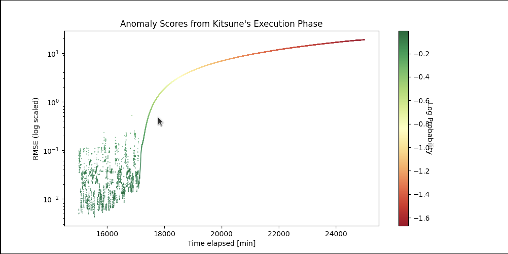
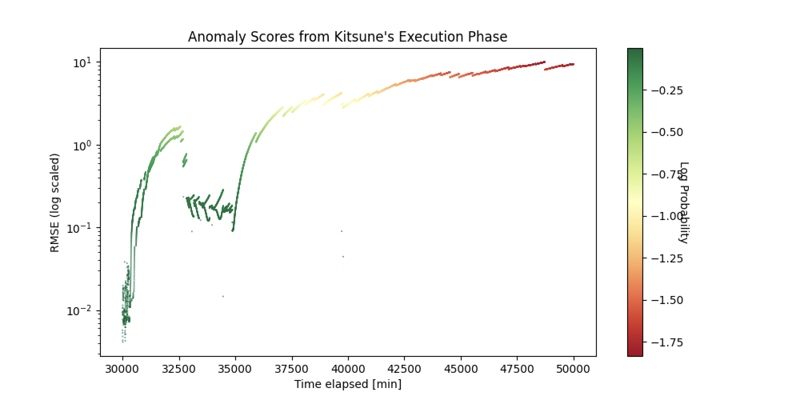

# Litsune: A Network Intrusion Protection System

This project is an extension and reworking of Kitsune (*Mirsky, Doitshman, Elovici and Shabtai*) 
by Andrew Lockett, Aaron Siemsen, Gustavo Hernandez, Aldo Guerrero, and Brian Lee.

Litsune is an AI-powered intrusion prevention system built on KitNET, a lightweight model designed
to run in realtime on limited hardware for enhanced network security,

Whereas its predecessor, Kitsune, was built primarily for offline detection through packet capture files of previous
traffic, Litsune is a "live" version of Kitsune that reads incoming traffic through pyshark, parses features of interest
from individual packets, then passes that information to KitNET's layer of autoencoders.

This can be seen in the following diagram:

## Dependencies
The necessary dependencies are listed in `requirements.txt`: use `pip install -r requirements.txt` to install all suitable versions.
Additionally, IPTables and tshark have to be installed and added to the system path.

## Running Litsune

To try running Litsune on your machine, you can use the provided example file, realtime_stream.py. Upon running 
realtime_stream.py you will be prompted for the name of the interface you would like to capture traffic from. 
With no changes to this the script, the model will be in training mode for the first 50,000 captured packets, then 
automatically end the capture after 100,000 packets. When capture ceases, there will be an output graph of the anomaly
scores saved as ExampleOutTest.png 

*Example* 

`python realtime_stream.py`

## Contributions

### Session Tracking (by Aaron)
- Implemented per-IP session tracking for anomalous packets.
- Counts the number of anomalies triggered by each source IP.
- Provides the basis for deciding when to apply `iptables` blocks.

---

### Real-time Traffic Streaming (by Andrew)
- Added real-time traffic capture using PyShark.
- Enables continuous packet ingestion for the detection loop.

---

### Logging System (by Brian)
- Replaced all `print()` statements with a structured `loguru`-based logging system.
- Added persistent log files for runtime messages and errors.
- Logs now include anomalies, system events, and exceptions.

---

### IPTables Rule Creation (by Aldo)
- Added automatic IP blocking using `iptables` based on anomaly scores.
- Implemented `block_ip()` and `unblock_ip()` helper functions.
- Integrated dynamic blocking into the real-time detection pipeline.

---

### Updated Threshold Calculation (by Gustavo)
- Adopted a new thresholding approach based on the maximum training-set threshold observed.
- Refined final thresholds using a standard deviation–based formula for improved stability.

## Underlying Papers and References

### Liuer Mihou — *A Practical Framework for Generating and Evaluating Grey-box Adversarial Attacks against NIDS*
This paper examines structural weaknesses in machine-learning–based Network Intrusion Detection Systems (NIDS), including those similar to Kitsune. It demonstrates how these models can be vulnerable to grey-box adversarial attacks and introduces a framework for generating such attacks. The framework enables training on more diverse and realistic adversarial scenarios, improving the robustness of NIDS models.  
**Link:** https://arxiv.org/pdf/2204.06113

### NIDH — *Network Intrusion Detection Hierarchy: A Model for Gathering Attack Intelligence*
This work proposes a hierarchical, distributed architecture for network intrusion detection inspired by systems such as Squid’s proxy network. It describes how trusted nodes can collaboratively gather, share, and refine attack intelligence, forming a scalable and resilient infrastructure. The model offers conceptual foundations for enhancing systems like Litsune through distributed detection and coordinated threat response.  
**Link:** https://www.jstor.org/stable/26485923

## Sample Runs Against DoS Attack

Below are example outputs from Litsune when detecting and responding to a DoS attack.

### DoS Attack - Run 1

### DoS Attack - Run 2
